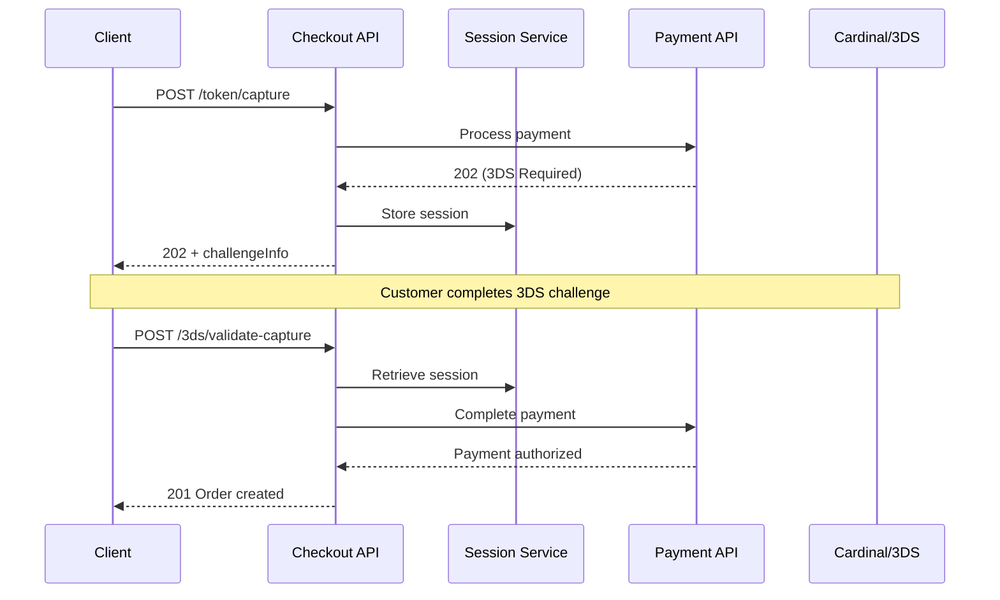

# Advanced 3DS Authentication Integration Guide

This guide covers implementing 3D Secure (3DS) authentication with the Checkout API, including stateful session management and Payment API v0.3.0 integration.

## 📋 Prerequisites

Before implementing 3DS authentication:

1. ✅ Complete the [Basic Payment Integration](./getting-started-payments.md)
2. ✅ Understand tokenized payments with `@dw-digital-commerce/payments-sdk`
3. ✅ Have access to Cardinal Commerce/Cybersource 3DS credentials
4. ✅ Review the [complete architecture documentation](../architecture/3ds-stateful-design/)

## 🎯 When Do You Need 3DS?

3DS authentication is required when:
- Payment amount exceeds £150 (configurable threshold)
- Card issuer requires Strong Customer Authentication (SCA)
- Risk assessment indicates additional verification needed
- Regulatory compliance (PSD2 in Europe) mandates it

## 🔄 3DS Flow Overview



## 🚀 Quick Start Implementation

### Step 1: Initial Token Capture

```typescript
const captureResponse = await fetch('/checkout/me/token/capture', {
  method: 'POST',
  body: JSON.stringify({
    cartId: 'cart-123',
    version: 1,
    payments: [{
      type: 'tokenised',
      amount: { amount: 159.99, currencyCode: 'GBP' },
      tokenisedPayment: {
        paymentToken: 'tkn_abc123',
        tokenType: 'transient',
        billTo: { /* billing details */ },
        threeDSData: {
          phase: 'setup',
          setup: { referenceId: '3ds-ref-123' }
        }
      }
    }]
  })
});

if (captureResponse.status === 202) {
  // 3DS authentication required
  const { challengeInfo, threeDSSessionId } = await captureResponse.json();
  // Proceed to Step 2
}
```

### Step 2: Present 3DS Challenge

```typescript
// Critical: Use stepUpToken from Payment API v0.3.0
const { stepUpUrl, stepUpToken } = challengeInfo;

// Create iframe for 3DS challenge
const iframe = document.createElement('iframe');
iframe.src = 'about:blank';
document.body.appendChild(iframe);

// POST stepUpToken to Cardinal Commerce
const form = iframe.contentDocument.createElement('form');
form.method = 'POST';
form.action = stepUpUrl;

const jwtInput = document.createElement('input');
jwtInput.name = 'JWT';  // Cardinal expects 'JWT' parameter
jwtInput.value = stepUpToken;  // CRITICAL: Required for v0.3.0
form.appendChild(jwtInput);

form.submit();
```

### Step 3: Complete Payment After 3DS

```typescript
// After customer completes 3DS challenge
const validateResponse = await fetch('/checkout/me/3ds/validate-capture', {
  method: 'POST',
  body: JSON.stringify({
    threeDSSessionId: sessionId,  // From Step 1
    threeDSData: {
      phase: 'completion',
      completion: {
        authenticationTransactionId: 'auth-txn-456',
        cavv: 'AAABCZIhcQAAAABZlyFxAAAAAAA=',
        eciIndicator: '05'
      }
    }
  })
});

if (validateResponse.status === 201) {
  const order = await validateResponse.json();
  // Order created successfully!
}
```

## 📚 Complete Documentation

For comprehensive implementation details, see:

### Core Documentation
- **[Complete 3DS Implementation Guide](../architecture/3ds-stateful-design/INTEGRATION-Payments-SDK-Mapping.md)** - 993 lines of detailed integration patterns
- **[Architecture Decision Record](../architecture/3ds-stateful-design/ARCHITECTURE-3DS-Stateful-Design-Decision.md)** - Why we chose stateful sessions
- **[Session Service Specification](../architecture/3ds-stateful-design/SPEC-Authentication-Session-Library.md)** - Technical details of session management
- **[User Story & Acceptance Criteria](../architecture/3ds-stateful-design/USER-STORY-3DS-Validate-Capture-Implementation.md)** - Business requirements

### Key Concepts from Full Documentation

#### Session Management (30-minute TTL)
- Sessions expire after 30 minutes
- Single-use enforcement prevents duplicate charges
- Session stores all payment context between capture and validate

#### Payment API v0.3.0 Alignment
- `challengeInfo` structure with `stepUpUrl` and `stepUpToken`
- Phase-based `threeDSData` discriminator model
- Complete diagnostic fields for troubleshooting

#### Error Handling
- 409 Conflict: Session expired or already used
- 422 Unprocessable: Cart modified or payment declined
- 403 Forbidden: Session ownership mismatch

## 🔧 Testing 3DS Flows

### Test Scenarios
1. **Amount > £150**: Triggers 3DS authentication
2. **Session Expiry**: Wait 31 minutes before validate-capture
3. **Cart Modification**: Change cart between capture and validate
4. **Double Submit**: Attempt validate-capture twice with same session

### Example Test Suite
See [examples/src/test-3ds-flow.ts](../../examples/src/) for complete test coverage.

## 🚨 Common Pitfalls

1. **Missing stepUpToken**: Without this JWT, Cardinal Commerce rejects the authentication
2. **Session Reuse**: Sessions are single-use; attempting reuse returns 409
3. **Cart Version Mismatch**: Modifying cart invalidates the session
4. **Token Expiry**: Transient tokens may expire during 3DS flow (15-minute TTL)

## 🔗 Related Resources

- [Basic Payment Integration](./getting-started-payments.md) - Start here first
- [Multi-Account Deployment](./multi-account-deployment.md) - AWS infrastructure setup
- [Payment API v0.3.0 Specification](https://api.swaggerhub.com/apis/Direct_Wines/payments-api/0.3.0)
- [Example Implementation](../../examples/) - Complete working examples

## 📖 Next Steps

1. Review the [complete implementation guide](../architecture/3ds-stateful-design/INTEGRATION-Payments-SDK-Mapping.md)
2. Understand the [architectural decisions](../architecture/3ds-stateful-design/ARCHITECTURE-3DS-Stateful-Design-Decision.md)
3. Implement session service following the [specification](../architecture/3ds-stateful-design/SPEC-Authentication-Session-Library.md)
4. Test thoroughly using the examples

---

**Last Updated:** 2025-11-07
**API Version:** v0.5.0
**Payment API Version:** v0.3.0