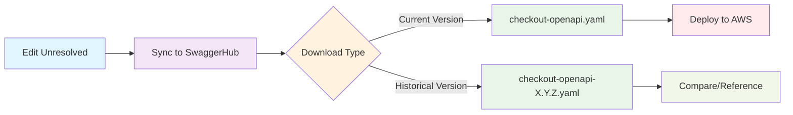

# Checkout API OpenAPI Specification Workflow

This document outlines the workflow for managing the Checkout API OpenAPI specification, separate from general Checkout API development. It covers validation, versioning, and publishing of the OpenAPI schema to SwaggerHub.

## 📋 Table of Contents

- [Overview](#overview)
- [Getting Started](#getting-started)
- [Available Scripts](#available-scripts)
- [Development Workflow](#development-workflow)
- [Validation](#validation)
- [Publishing](#publishing)
- [Version Management](#version-management)
- [Troubleshooting](#troubleshooting)

## 🌟 Overview

The Checkout API OpenAPI specification is managed independently from the Checkout API codebase. This workflow allows you to:

- **Validate** OpenAPI specifications against standards
- **Version** the API specification independently
- **Publish** to SwaggerHub for sharing and documentation
- **Sync** development versions for testing

**Target Files**:

- **Master Source**: `../openapi/checkout-openapi-unresolved.yaml`
- **Generated Output**: `../openapi/checkout-openapi.yaml`

## 📋 File Structure

### Unresolved vs Resolved Specifications

This workflow manages two versions of the OpenAPI specification:

**🔧 Unresolved Specification** (`checkout-openapi-unresolved.yaml`)

- **Purpose**: Master source for development and editing
- **Content**: Contains `$ref` references to shared components and schemas
- **Maintainability**: Easier to maintain, no duplication, modular structure
- **Usage**: Edit this file directly, sync to SwaggerHub for collaboration

**📦 Resolved Specification** (`checkout-openapi.yaml`)

- **Purpose**: Deployment-ready version for AWS API Gateway
- **Content**: All `$ref` references expanded inline (resolved)
- **Generation**: Automatically generated by downloading from SwaggerHub
- **Usage**: Used by AWS CDK/CloudFormation for API Gateway deployment

### Workflow Integration



**Why This Approach?**

- **Developer Experience**: Work with clean, modular specifications using `$ref`
- **Deployment Compatibility**: AWS API Gateway requires fully resolved specifications
- **Version Control**: Only track the unresolved version in git (resolved is generated)
- **Collaboration**: SwaggerHub provides resolution and documentation services

## 🚀 Getting Started

### Prerequisites

- Node.js 22+
- npm 11+
- Git
- SwaggerHub API Key (for publishing)

### Setup Steps

1. **Install dependencies**

   ```bash
   cd openapi-spec-workflow
   npm install
   ```

2. **Validate everything works**

   ```bash
   npm run validate    # Run all validations
   ```

3. **Optional: Set up SwaggerHub sync** (for testing your changes)
   ```bash
   export SWAGGERHUB_API_KEY="your-api-key"
   npm run sync:dev
   ```

## 📜 Available Scripts

| Script                                       | Description                                                       |
| -------------------------------------------- | ----------------------------------------------------------------- |
| `npm run validate`                           | Run complete validation suite                                     |
| `npm run validate:spectral`                  | Run Spectral API linting                                          |
| `npm run validate:schemas`                   | Validate OpenAPI schema structure                                 |
| `npm run version:bump <major\|minor\|patch>` | Update package.json and schema versions synchronously             |
| `npm run sync:dev`                           | Sync unpublished (editable) version to SwaggerHub                 |
| `npm run download:resolved`                  | Download resolved specification from SwaggerHub (current version) |
| `npm run download:resolved:force`            | Force download, overwrite existing file                           |
| `npm run download:resolved:0.5.0`            | Download specific version 0.5.0 as versioned file                 |
| `npm run download:resolved:0.5.0:force`      | Download version 0.5.0 with force overwrite                       |
| `npm run download:resolved:crlf`             | Download with Windows line endings (CRLF)                         |
| `npm run download:resolved:auto`             | Download with platform default line endings                       |
| `npm run publish:dev`                        | Alias for sync:dev                                                |
| `npm run publish:prod`                       | Publish (read-only) version to SwaggerHub                         |
| `npm run version:help`                       | Show version management help                                      |

## 🛠️ Development Workflow

This workflow is designed for OpenAPI specification changes and follows branch protection rules.

### Phase 1: Version Preparation (via PR)

1. **Create feature branch** (must match pattern: `feature/TICKET-###-description`)

   ```bash
   git checkout -b feature/CHECK-108-update-openapi-spec
   ```

2. **Bump version** (updates package.json and schema file synchronously)

   ```bash
   npm run version:bump minor  # or major/patch
   ```

3. **Make OpenAPI specification changes** in `../openapi/checkout-openapi-unresolved.yaml`

4. **Validate changes**

   ```bash
   npm run validate
   ```

5. **Optional: Sync to SwaggerHub for testing** (creates unpublished, editable version)

   ```bash
   export SWAGGERHUB_API_KEY="your-api-key"
   npm run sync:dev
   ```

6. **Optional: Download resolved specification** (get version with expanded $ref for local deployment)

   ```bash
   # Download current version (saves as checkout-openapi.yaml)
   npm run download:resolved

   # Download specific version (saves as checkout-openapi-0.5.0.yaml)
   npm run download:resolved -- --version 0.5.0

   # Download with Windows line endings
   npm run download:resolved -- --line-endings crlf
   ```

7. **Commit and push branch**

   ```bash
   git add package.json package-lock.json ../openapi/checkout-openapi-unresolved.yaml
   # Optional: Also add resolved spec if downloaded
   # git add ../openapi/checkout-openapi.yaml
   git commit -m "feat(openapi): update Checkout API specification to v0.6.0"
   git push -u origin feature/CHECK-108-update-openapi-spec
   ```

8. **Create PR**
   ```bash
   gh pr create --title "feat(openapi): update Checkout API specification to v0.6.0" --body "Updates OpenAPI specification with new endpoints and schema improvements"
   ```

### Phase 2: Release (after PR merged)

9. **Create release tag** (triggers automated publishing to SwaggerHub via GitHub Actions)
   ```bash
   git checkout main && git pull
   git tag v0.6.0 && git push --tags
   ```

### Branch Naming Requirements

Pattern: `^(feature|release|bugfix|hotfix)\/[A-Za-z]{2,}\-[0-9]{1,5}\-.*$`

## ✅ Validation

The validation system includes multiple layers:

### Complete Validation

```bash
npm run validate
```

### Individual Validation Layers

```bash
npm run validate:spectral  # OpenAPI linting and design consistency
npm run validate:schemas   # OpenAPI 3.0 spec compliance
```

### Validation Features

- **Spectral Linting**: Ensures OpenAPI best practices
- **Schema Validation**: Validates against OpenAPI 3.0 specification
- **Custom Rules**: Direct Wines specific validation rules
- **Version Consistency**: Ensures package.json and schema versions match

## 📤 Publishing

The publishing system uses a two-phase workflow:

### Development Phase (Unpublished)

For active development and testing:

```bash
# Set up your API key (one time)
export SWAGGERHUB_API_KEY="your-api-key"

# Sync changes to SwaggerHub as unpublished (editable)
npm run sync:dev
```

This creates an **unpublished, editable** version in SwaggerHub that you can iterate on.

### Production Phase (Published)

For stable releases:

```bash
# Option 1: Automatic (recommended)
git tag v0.6.0
git push origin v0.6.0

# Option 2: Manual
npm run publish:prod
```

This creates a **published, read-only** version that becomes the stable release.

### Publishing Workflow

| Stage       | Command            | SwaggerHub Status      | Use Case                    |
| ----------- | ------------------ | ---------------------- | --------------------------- |
| Development | `npm run sync:dev` | Unpublished (editable) | Active development, testing |
| Production  | `git tag v0.6.0`   | Published (read-only)  | Stable releases             |

### SwaggerHub Links

- **API**: https://app.swaggerhub.com/apis/Direct_Wines/checkout-api
- **Current Version**: https://app.swaggerhub.com/apis/Direct_Wines/checkout-api/0.5.0

## 🎯 Version Management

### Semantic Versioning

The OpenAPI specification follows semantic versioning independently from the Checkout API application:

- **Major** (0.5.0 → 1.0.0): Breaking changes to API structure
- **Minor** (0.5.0 → 0.6.0): New endpoints, non-breaking changes
- **Patch** (0.5.0 → 0.5.1): Documentation updates, bug fixes

### Version Bump Process

```bash
# Update both package.json and OpenAPI schema versions
npm run version:bump minor  # Bumps 0.5.0 → 0.6.0
```

### Historical Version Access

Download any previous version for comparison or rollback:

```bash
# Download specific version as versioned file
npm run download:resolved -- --version 0.5.0  # → checkout-openapi-0.5.0.yaml
npm run download:resolved -- --version 0.4.0  # → checkout-openapi-0.4.0.yaml

# Or use convenience scripts
npm run download:resolved:0.5.0
```

### File Naming Convention

| Download Type        | Filename                          | Use Case                         |
| -------------------- | --------------------------------- | -------------------------------- |
| **Current Version**  | `checkout-openapi.yaml`           | AWS API Gateway deployment       |
| **Specific Version** | `checkout-openapi-{version}.yaml` | Historical reference, comparison |

**Examples:**

- `npm run download:resolved` → `checkout-openapi.yaml` (current: 0.5.0)
- `npm run download:resolved -- --version 0.5.0` → `checkout-openapi-0.5.0.yaml`
- `npm run download:resolved -- --version 0.4.0` → `checkout-openapi-0.4.0.yaml`

### Version Consistency

The system ensures version consistency between:

- `package.json` version
- OpenAPI specification `info.version` field

## 🖥️ Cross-Platform Line Ending Control

The download script supports different line ending formats for cross-platform compatibility:

### Line Ending Options

| Option         | Format           | Platform         | Usage                          |
| -------------- | ---------------- | ---------------- | ------------------------------ |
| `lf` (default) | `\n`             | Unix/Linux/macOS | Most development environments  |
| `crlf`         | `\r\n`           | Windows          | Windows-specific tools/editors |
| `auto`         | Platform default | Current system   | Automatic platform detection   |

### Usage Examples

```bash
# Download with specific line endings
npm run download:resolved -- --line-endings crlf     # Windows format
npm run download:resolved -- --line-endings lf       # Unix format (default)
npm run download:resolved -- --line-endings auto     # Platform default

# Combine with version selection
npm run download:resolved -- --version 0.5.0 --line-endings crlf

# Convenience scripts
npm run download:resolved:crlf  # Windows line endings
npm run download:resolved:auto  # Platform default
```

### When to Use Different Line Endings

- **lf (default)**: Git repositories, CI/CD pipelines, most development
- **crlf**: Windows-specific tools, legacy Windows applications
- **auto**: Mixed-platform teams, when unsure about target environment

**Note**: Most modern tools handle line ending conversion automatically, so the default `lf` option works for most scenarios.

## 🔧 Troubleshooting

### Common Issues

**SwaggerHub API Key Issues**

```bash
# Ensure your API key is set
export SWAGGERHUB_API_KEY="your-api-key"

# Verify SwaggerHub CLI access
npx swaggerhub --version
```

**Version Mismatch Errors**

```bash
# Fix version inconsistencies
npm run version:bump patch  # This syncs both files
```

**Validation Failures**

```bash
# Run detailed validation
npm run validate

# Check individual validation layers
npm run validate:spectral
npm run validate:schemas
```

**Resolved Specification Download Issues**

```bash
# Ensure API version exists on SwaggerHub first
npm run sync:dev

# Force download to overwrite existing file
npm run download:resolved -- --force

# Download specific version (creates versioned file)
npm run download:resolved -- --version 0.5.0

# Check if version exists on SwaggerHub
# Visit: https://app.swaggerhub.com/apis/Direct_Wines/checkout-api/[version]

# Verify API key has proper permissions for the organization
export SWAGGERHUB_API_KEY="your-api-key"
npx swaggerhub api:get Direct_Wines/checkout-api --json

# Test version format validation
npm run download:resolved -- --version invalid.format  # Shows error
npm run download:resolved -- --version 0.5.0          # Valid format

# Test line ending options
npm run download:resolved -- --line-endings invalid    # Shows error
npm run download:resolved -- --line-endings crlf       # Valid option
```

**Branch Protection Issues**

- Always work on feature branches, never directly on `main`
- Use proper branch naming: `feature/TICKET-123-description`

### Getting Help

- **Validation Errors**: Check the OpenAPI specification syntax
- **SwaggerHub Issues**: Verify API key permissions and organization access
- **Version Conflicts**: Use the version bump script to maintain consistency
- **Git Issues**: Ensure you're on a feature branch with proper naming

### File Locations

- **Unresolved OpenAPI Spec** (Master): `../openapi/checkout-openapi-unresolved.yaml`
- **Resolved OpenAPI Spec** (Generated): `../openapi/checkout-openapi.yaml`
- **Validation Config**: `.spectral.yaml`
- **Scripts**: `scripts/` directory
- **Dependencies**: `package.json`

---

**Maintained by**: DW Digital Commerce Team
**Related APIs**: [Checkout API Repository](https://github.com/dw-digital-commerce/my-checkout-api)
**Last Updated**: November 2025
